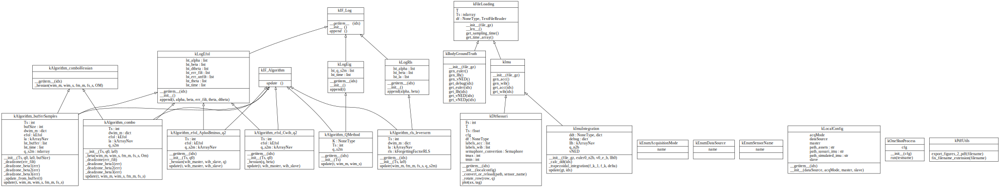
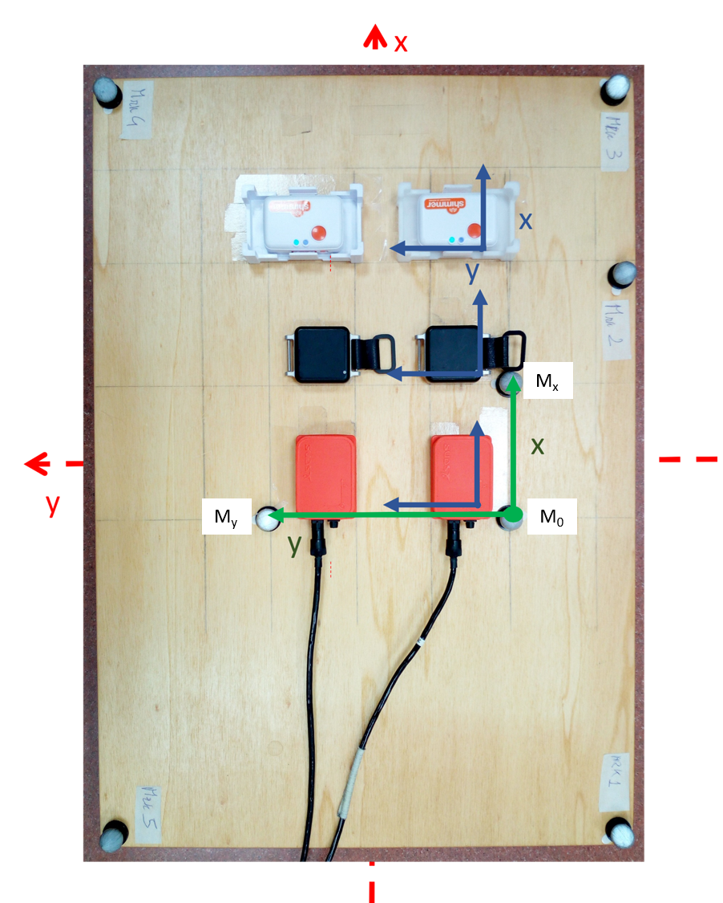
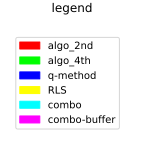
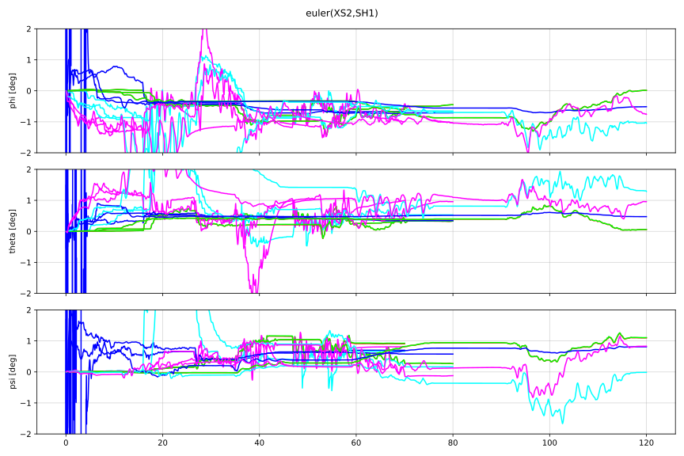
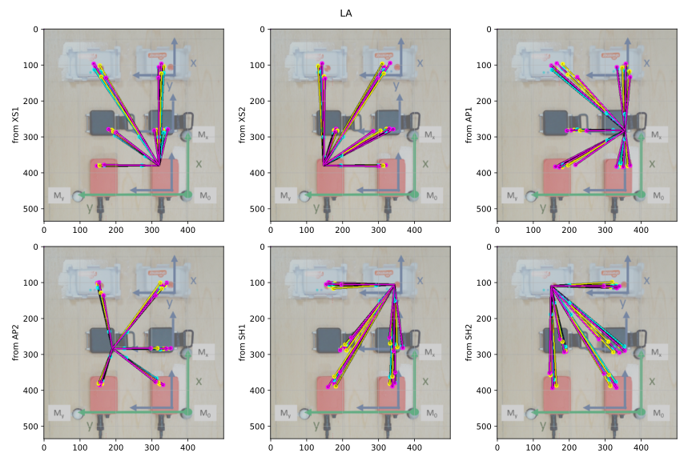

- [1
  Introduction](#introduction)
- [2 Assumptions](#assumptions)
- [3 Review](#review)
- [4 Motivation](#motivation)
- [5 Code and
  Dataset](#code-and-dataset)
  - [5.1 About the
    Dataset](#about-the-dataset)
  - [5.2 Sensors](#sensors)
  - [5.3
    Orientation](#orientation)
  - [5.4 Notation](#notation)
- [6 Algorithms](#algorithms)
  - [6.1 Algorithm
    2nd](#algorithm-2nd)
  - [6.2 Algorithm
    4th](#algorithm-4th)
  - [6.3 Algorithm
    5th](#algorithm-5th)
  - [6.4 Algorithm
    6th](#algorithm-6th)
  - [6.5 Algorithm 8th -
    Combo](#algorithm-8th---combo)
  - [6.6 Algorithm 9th - Combo
    with Buffer](#algorithm-9th---combo-with-buffer)
- [7 Results](#results)
  - [7.1 Legend](#legend)
  - [7.2
    Misalignment](#misalignment)
  - [7.3 Lever-Arm](#lever-arm)

# Introduction

This hobby-project had the goal to estimate the misalignment and the relative
displacement among inertial sensors, aka. lever-arm estimation.

The topic is not new, and it is normally broken down in two categories that define
the system model and algorithms to have used:

- sensor alignment on a rigid frame, and
- transfer alignment on an oscillating frame.

Although on a rigid frame, the system is allowed to change dynamically, but the changes can be included on the model 
and support the estimation process.

The transfer alignment topic is relevant when the inertial alignment of a system shall be transferred at least once to
another system with unknown alignment. Some examples of this issue are:

- alignment between an aircraft and a missile attached by a flexible wing, or
- alignment between master and slave IMUs on a flexible ship.

This project will deal only with the case of a rigid frame, under the assumptions below.

Hereafter the relative displacement will be referred simply as lever-arm.

# Assumptions

- the lever-arm among the sensors is not considered static. This means that it
can change over time, but it is not caused by oscillation due to flexibility of
parts.

- the misalignment is also not considered static. It might drift and change over
time.

- any estimation is allowed to deteriorate with time due to changes in the
environment. For example, sensors in the side-mirror might have different
alignments when parking or driving at high speeds.

- besides the inertial measurements, there is no additional source of
information; this fact implies that sensor bias cannot be estimated during the
process.

# Review

The problem is normally divided into its two components:
- one solution to the misalignment, and
- using the solution above, estimate the misalignment.

Either in 1965 or 1966 Grace Wahba formulated the misalignment problem as a
cost function summing up errors between reference vectors and misaligned ones
but corrected by a transformation. A NASA's declassified technical note from
1968 signed by Paul Davenport [https://ntrs.nasa.gov/citations/19680021122]
presents a solution for the *Wahba's cost function*, the so called *Q-Method*.
Davenport employs quaternions in the solution, and extends the cost function to
include the constraint that the norm of quaternions is constant and equal to 1.
The solution is simple and very easy to implement. Moreover, it has some
immunity to noise as it accumulates several measurements to build a matrix with
static eigenvectors. However,

- due to the growing accumulation, the method needs a heuristic to avoid
overflow of the matrix;
- the method considers a static solution, i.e. the calculated quaternion does
not change with time.

Once the misalignment is identified and corrected, the next step is to
estimated the lever-arm. From IMU measurements, the model cannot be other than
the Coriollis equation, which is rewritten in a way that a RLS filter is then
used to estimate the lever-arm. This approach is robust to dynamic changes and
converges rapidly to the correct values, but depends on the data correction
based on the Q-Method.

# Motivation

My interest was to verify whether misalignment and lever-arm can be estimated
simultaneously using the
[EFOL](https://github.com/conconga/estimators/tree/main/efol) approach

# Code and Dataset

I tried several algorithms, nine in total. I show here the results of some of them.
The complete code is available here, and will be updated as I come back to the project and
make new tests.

As I do not have a dataset to make the evaluation, I searched around for an open
dataset. I found one which I will always refer as `sassari` dataset. As
requested by the respective authors, here is the reference to their work:
[check it
out!](https://github.com/marcocaruso/mimu_optical_dataset_caruso_sassari/releases)

> When using this dataset, please cite: M. Caruso, A. M. Sabatini, M. Knaflitz,
> M. Gazzoni, U. D. Croce and A. Cereatti, "Orientation Estimation Through
> Magneto-Inertial Sensor Fusion: A Heuristic Approach for Suboptimal Parameters
> Tuning," in IEEE Sensors Journal, vol. 21, no. 3, pp.  3408-3419, 1 Feb.1,
> 2021, doi: 10.1109/JSEN.2020.3024806.
> https://ieeexplore.ieee.org/document/9201115

## About the Dataset

Maybe some assumptions I make here are covered or described in the article, but
I do not have access to it behind the paywall.

The authors release with the data a picture of the setup:

{width=200px}

There are neither sketches nor diagrams nor information about dimensions and
distances. Moreover, the picture is not orthogonal, but a perspective. Anyhow,
it is the best I have to move on now.

Based on the datasheets of the sensors, I used their dimensions to have some notion of scale
about the picture. This will be important when depicting the results only.

## Sensors

| Manufacturer |  Product  | Abbreviation | Dimensions | Color   |
| :----------: | :-------: | :----------: | :--------: | :----:  |
| Xsens        | MTx       | XS1, XS2     | 53 x 38    |  red    |
| APDM         | Opal      | AP1, AP2     | 40 x 55    | black   |
| Shimmer      | Shimmer3  | SH1, SH2     | 32 x 65    | white   |

## Orientation

I use the scripts with some simulated data, and the orientation follows the
common sense in aeronautic, with X forward and Z downward.  Sassari is
transformed to this convention before using it. The object `kDbSassari`
performs this task.

In case another dataset is available, the modular preprocessing of the data
plus a uniform data-feeding interface allows the code to be extended by means
of a factory and abstract contracts.

## Notation

- Underlined variables are vectors or matrices.
- I use the same notation described in the
[EFOL](https://github.com/conconga/estimators/tree/main/efol) documentation.
- All terms related to Navigation equations adopt classic notation (MIT Notation) and
is widely used, for example, by Britting, Farrell, Chatfield, Titterton, and others.
- Sub- and superscripts with $m$ refer to the *master frame* and $s$, to the *slave frame*.
- The letter $q$ is always a quaternion, with dimension $[4x1]$.
- The algebra for quaternion is described in the submodule `knavigation`,
mostly learned in the book from Titterton.

# Algorithms

I will skip here some intermediate and test algorithms, and I will refer only
to the ones with interesting results.

## Algorithm 2nd

This algorithm is based on EFOL, and estimates only the misalignment. The
vectors $\underline{\alpha}(t)$ and $\underline{\beta}(t)$ are composed by two
equations:

| $\underline{\alpha}(t)$ | $\underline{\beta}(t)$ |
| :---------------------: | :--------------------: |
| $\underline{\omega}_{im}^{m}$ | $\underline{R}_{s}^{m} \underline{\omega}_{is}^{s}$ |
| 1 | $\| \underline{q} \|$ |

The second equation is a constraint to keep the norm of the quaternion close to 1.0. It will
deviate a bit, but there is a step of normalization, and the result if better when its norm
is already close to 1.0.

The algorithm is located in the file [`kAlgo2nd.py`](kAlgo2nd.py).

## Algorithm 4th

This algorithm is also based on EFOL, and estimates only the misalignment. It
uses some properties of quaternions to skip most of the associated
nonlinearities.  The vectors $\underline{\alpha}(t)$ and
$\underline{\beta}(t)$ are composed by two equations:

| $\underline{\alpha}(t)$ | $\underline{\beta}(t)$ |
| :---------------------: | :--------------------: |
| $\underline{0}$ | $\left( \left[ \underline{\omega}_{is}^{s} \right]^+ -
        \left[ \underline{\omega}_{im}^{m} \right]^- \right) \cdot \underline{q}_{s}^{m}$ |
| 1 | $\| \underline{q} \|$ |

This algorithm is located in the file [`kAlgo4th.py](kAlgo4th.py).

## Algorithm 5th

This algorithm is an implementation of the *Q-Method* developed by Davenport, and
it is located in the file [`kAlgoQ.py`](kAlgoQ.py).

## Algorithm 6th

This algorithm is a bare implementation of a RLS solution using the Coriollis
equation connecting *master* and *slave* frames. This algorithm needs however
that the inputs be removed from any misalignment. Therefore its performance is
dependent on an additional algorithm to estimate the misalignment.

This algorithm is located in the file [`kAlgoRLS.py`](kAlgoRLS.py).

## Algorithm 8th - Combo

Using EFOL, this algorithm estimates simultaneously misalignment and lever-arm by means of these
equations:

| $\underline{\alpha}(t)$ | $\underline{\beta}(t)$ |
| :---------------------: | :--------------------: |
| $\underline{0}$ | $\left( \left[ \underline{\omega}_{is}^{s} \right]^+ -
        \left[ \underline{\omega}_{im}^{m} \right]^- \right) \cdot \underline{q}_{s}^{m}$ |
| $\underline{0}$ | $\left( \left[ \underline{f}_m^m + \underline{\Omega}\underline{r}_a^m
        \right]^- - \left[ \underline{f}_s^s \right]^+ \right) \cdot \underline{q}_s^m$   |
| 1 | $\| \underline{q} \|$ |

where $\Omega = \Omega_{im}^{m} \cdot \Omega_{im}^{m} + \dot{\Omega}_{im}^{m}$ and
$\underline{r}_a$ is the lever-arm.

## Algorithm 9th - Combo with Buffer

This algorithm is very similar to the 8th, but it decimates the time and
accumulates some samples of sensor data before updating the outputs. It is
expected here to have some immunity to noise, and a more stable convergence, at
the expense of lower bandwidth.

# Results

## Legend

The same colors will be used for all algorithms in each picture. The Sassari
dataset has three sample-acquisitions: slow, medium and fast. The pictures
overlap all
algorithms and all acquisitions.

## Misalignment

For the Sassari setup, I do not expect any change in the displacement and
alignment of the sensors. At least, if any, these changes are not documented.
Given that the Q-Method estimates a static misalignment, the respective
algorithm shall be a good option here, and possibly it will provide the most
accurate results.  It is weird though, that it changes its rate close to after
90[s]. Was there any loose component in the setup?

## Lever-Arm

I mentioned before that I have neither the sketch of the setup nor an
orthogonal picture of it. Based on the dimensions of the sensors in the
datasheets, I came up with a scale for the picture, but without any assurance
of accuracy. The results depict reasonably good the lever-arm among the
sensors. The picture speaks for itself...

Remark: The diagrams below were created using the last estimation of the
lever-arm, after having all input samples processed.

